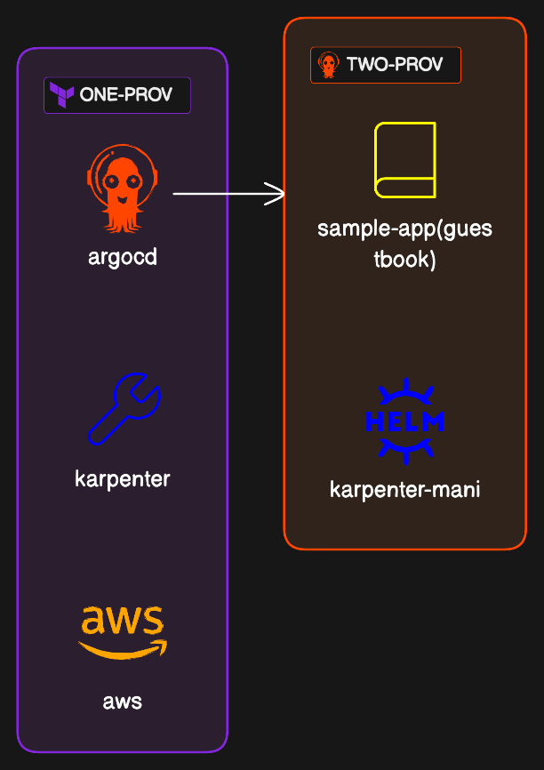

# AWS EKS Better Practice with Terraform

## Update **frequently**(break points)

### Kubeconfig(Pre-requisite)

- awscli
- kubectx

```sh
export AWS_PROFLIE=YOUR_PROFILE
export CLUSTER_NAME=YOUR_CLUSTER_NAME

# Cleanup
# caveat: the cluster and context would be removed but the USER would NOT
k ctx -d $AWS_PROFILE@$CLUSTER_NAME
k config delete-cluster $CLUSTER_NAME

# TODO: more elegant way e.g. cli, krew?
# Set a simple context and user name,
# each with CLUSTER_NAME and AWS_PROFLIE, not the verbose arn
aws eks update-kubeconfig --name $CLUSTER_NAME --alias $AWS_PROFILE@$CLUSTER_NAME --user-alias $AWS_PROFILE
# Set a simple cluster name over the verbose arn
sed -i s%$(aws eks describe-cluster --name $CLUSTER_NAME | jq -r .cluster.arn | awk -F/ '{ print $1"/" }')%% -- $HOME/.kube/config
```

## Roadmap

Implement [EKS workshop](https://www.eksworkshop.com/)'s each part

- [Fundamentals](https://www.eksworkshop.com/docs/fundamentals/)
  - [x] [Fargate](https://www.eksworkshop.com/docs/fundamentals/fargate/)
  - [ ] [AWS Load Balancer Controller](https://www.eksworkshop.com/docs/fundamentals/exposing/aws-lb-controller)
  - [Storage](https://www.eksworkshop.com/docs/fundamentals/storage/)
    - [ ] [EBS](https://www.eksworkshop.com/docs/fundamentals/storage/ebs/)
    - [ ] [EFS](https://www.eksworkshop.com/docs/fundamentals/storage/efs/)
- [Autoscaling](https://www.eksworkshop.com/docs/autoscaling/)
  - [ ] [Karpenter](https://www.eksworkshop.com/docs/autoscaling/compute/karpenter/)
  - [ ] [Horizontal Pod Autoscaler](https://www.eksworkshop.com/docs/autoscaling/workloads/horizontal-pod-autoscaler/)
  - [ ] [Cluster Proportional Autoscaler](https://www.eksworkshop.com/docs/autoscaling/workloads/cluster-proportional-autoscaler/)

## Diagrams

### Two-steps of Provisioning



- One provisionig with Terraform
  - VPC
  - EKS cluster
  - Karpenter(AWS' things)
  - Helm
    - Karpenter
    - ArgoCD
- Two provisioning with ArgoCD
  - Karpenter things
    - AWSNodeTemplates
    - Provisioners
  - Sample applications

How to connect two steps?

- Terraform outputs should be passed Helm(ArgoCD) values.
